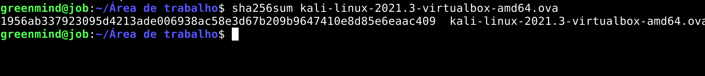

# Criando Lab Linux - Kali

## O que é o Kali Linux
O Kali Linux que antigamente era conhecido como BackTrack Linux é uma distribuição Linux que é baseada em Debian e tem o código aberto voltada para testes de penetração avançados e auditoria de segurança.

O Kali Linux contém diversas de ferramentas voltadas para diversas tarefas de segurança da informação, como pentests, computação forense e engenharia reversa.

Kali Linux foi lançado em 13 de março de 2013 como uma reconstrução completa de cima para baixo do BackTrack Linux, aderindo completamente aos padrões de desenvolvimento do Debian.

> https://www.kali.org/docs/introduction/what-is-kali-linux/

## Site oficial
### Download
> https://www.kali.org/get-kali/#kali-virtual-machines


Como estamos realizando o uso do Virtualbox, vamos realizar o dowload da maquina virtual para o Virtualbox.

Podemos usar o link abaixo para realizar o download:
> https://kali.download/virtual-images/kali-2021.3/kali-linux-2021.3-virtualbox-amd64.ova

> DICA: Recomendo uGet para gerenciar o download e assim ser mais rapido o download da imagem.

Vamos checar ve se a imagem está tudo ok e confirmar que a imagem não está corrompida ou foi modificada.


> SHA256sum
1956ab337923095d4213ade006938ac58e3d67b209b9647410e8d85e6eaac409

### Verificando ISO
Vimos Anteriormente que tinhamos uma **SHA256sum** ao realizar download do kali, agora vamos checar a ISO.
```sh
sha256sum kali-linux-2021.3-virtualbox-amd64.ova
```


## Importando maquina
Vamos agora importar nossa maquina para o nosso Virtualbox.

Vamos abrir o virtualbox.


Vamos clicar em **Importar** para realizar a importação da maquina.

> Em seguida vamos clicar em **Proximo**.

Agora podemos ver informações da nossa maquina como memoria utilizada, CPU, placa de rede usada e etc.
> Vamos finalizar clicar em **Importar**.


Vamos aceitar termos e condições do Kali.

> **Concordo (A)**

## Configurando
### Configurando - Rede
Podemos configurar nossa rede de forma simples, basta clicarmos em **configurações** e em seguida em **rede**.


Em seguida só precisamos clicar em **OK**.


## Alterando usuario
Por padrão a maquina vem com o usuario e senha:

- kali
- kali

Recomendo alterar usando
```sh
passwd
```

O mesmo para o usuario **root**.
```sh
sudo su
passwd
```

> DICA: Não esqueça a senha
