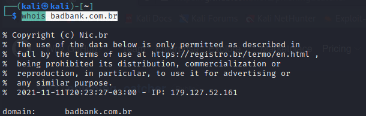
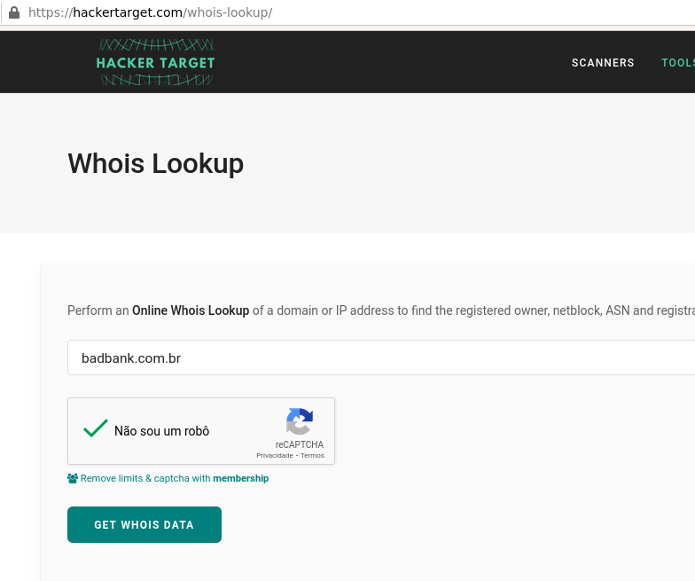
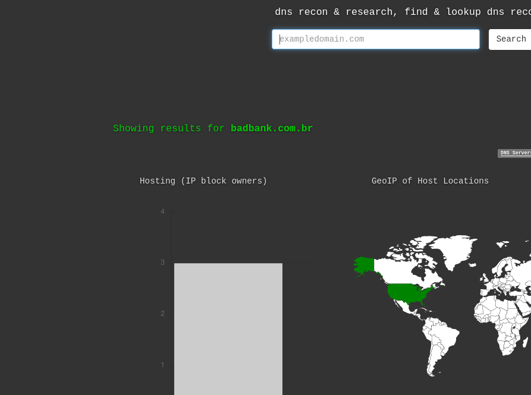

# Buscando informações sobre infraestruturas

## Validando informações sobre um dominio suspeito
### Whois
#### Whois o que é ?
O WHOIS é um protocolo da TCP/IP específico para consultar **informações de contato** e DNS sobre entidades na internet.

Uma entidade na internet pode ser:

- Nome de domínio;

- Um endereço IP;

- Sistema autônomo(Autonomous system).

#### Como usar ?
##### Clientes Linux
Em alguns sistemas Linux ele ja vem por padrão e podemos realizar uma consulta da seguinte forma:
```sh
whois badbank.com.br
```


##### Clientes Online
Alem de usar um cliente instalado em nossa maquina, podemos usar um projeto na versão online e dessa forma não precisar instalar.
> 

### SharingmyIP
> http://sharingmyip.com/

#### O que é o SharingMyIP?
O SharingMyIP é um projeto online(que podemos automatizar tambem via linha de comando), que nos informa quais dominios usam o mesmo IP, mesmo dominio e até informações de DNS.

Vamos imaginar que precisamos obter o máximo de informações sobre um domínio/subdomínio, como podemos fazer isso sem interagir diretamente com o alvo e sem realizar um consulta ao DNS de nossa maquina? Podemos saber quais sites estão compartilhando o mesmo IP usando o SharingMyIP.

Alem disso atualmente muitas empresas usam hosts compartilhados, seja para economizar, simplicidade e tambem infraestruturas comprometidas.
#### Desenvolvendo ferramenta usando Python
Podemos criar um script rápido para nos ajudar nos testes , veja o exemplo:
```python
import requests
from bs4 import BeautifulSoup

url = "https://globo.com"
ip = "10.10.10.10"
rec_site = requests.get('http://sharingmyip.com/?site='+url)
#print(rec_site.text)

soup = BeautifulSoup(rec_site.text,'html.parser')
#print("Sites para o IP:\n"+soup.textarea.string)

'''
for i in range(len(soup.textarea)):
    print(soup.textarea.string)
'''
qt_textarea = len(soup('textarea'))
msg_list = ['Site (s) neste endereço','DNS para ','Entradas de DNS relacionadas para']
#for msg in range(msg_list):
for i in range(qt_textarea):
    if (i == 0):
        print(msg_list[0]+" "+ip)
        print(soup('textarea')[i].string)
    elif i == 1:
        print(msg_list[1]+" "+url)
        print(soup('textarea')[i].string)
    elif i == 2:
        print(msg_list[2]+" "+url)
        print(soup('textarea')[i].string)
    else:
        print("Aconteceu algo errado :D")
```

Temos agora o mesmo resultado que o site , a diferença que temos essa informação com um script em python e que nós desenvolvemos.


### DNSdumpster
> https://dnsdumpster.com/

#### O que é DNSDumpster?
DNSDumpster nos ajuda a buscar informações com uso de OSINT, ele nos ajuda no:

- Reconhecimento;

- Pesquisa;

- Localização;

- Registros de DNS



Podemos buscar por hosts relacionados a um domínio, que vai nos retornar informações interessantes como:

- DNS Servers;

- MX Records;

- Host Records A;

Alem disso temos a possibilidade(se a infraestrutura ter informações disponiveis) ver um mapa com as informações obtidas sobre o domínio sobre uma infraestrutura podemos usar o DNSDumpster .

### Shodan
Conheça o site oficial
```sh
https://www.shodan.io/
```

#### Antes de começar
Agora não é só arquivos sensíveis que estão expostos na internet , nossos dispositivos conectados a internet também podem estar expostos e pessoas com má índole pode usar isso para o mal.

#### Como usar o Shodan ?
Vamos usar a versão web devido ao tempo que temos, mas futuramente vou disponibilizar como podemos usar o cliente via linha de comando.

O shodan podemos adicionar um simples IP ou usar operadores, os que vamos usar são os operadores:

- IP;
- hostname;
- http.title.

#### Realizando a busca
Podemos buscar por um determinado IP da seguinte forma.
```sh
ip:37.59.174.225
```

Podemos realizar outro exemplo usando o site da Globo.com
```sh
hostname:globo.com
```

Podemos buscar por informações no titulo usando o operador **http.title**.
```sh
http.title:"Empresa"
```

#### Documentação Oficial
> https://shodan.readthedocs.io/
