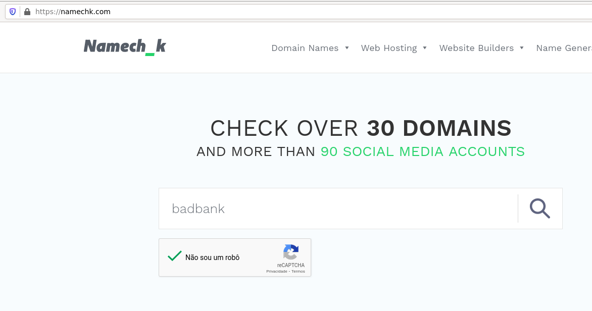
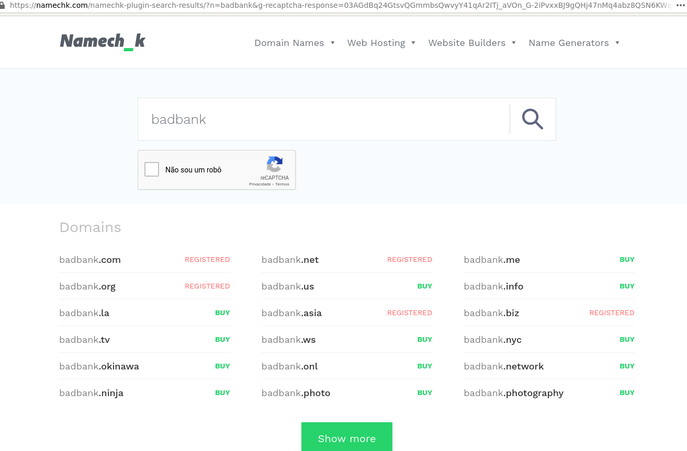
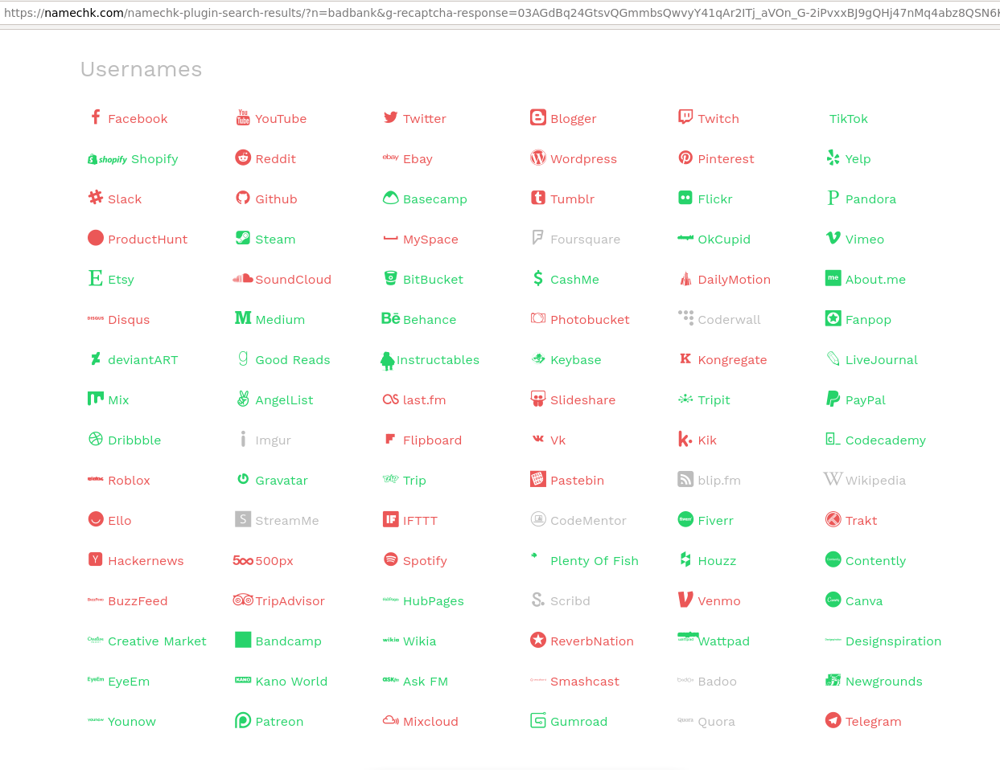

# Buscando paginas suspeitas
Diariamente usamos as redes sociais, muitos usuarios leigos acabam devido a facilidade buscando ajuda em paginas de redes sociais e isso pode ser um risco. Ainda mais quando paginas de SAC falsas tem um alcance grande e com diversos usuarios.

Aqui eu vou ensinar como podemos buscar por paginas suspeitas usando soluções e consultas avançadas.
## namechk
### O que é o namechk ?
O namechk é uma solução via web que nos auxilia na busca de dominios e o mais importante **nomes de usuario**. Dessa forma adicionando um determinado nome que queremos buscar, a solução vai buscar por diversas redes sociais que usam o mesmo nome.
> https://namechk.com/

### Como posso usar o namechk ?
Vamos adicionar um determinado nome que queremos analisar.


Podemos ver os resultados de dominios que ele retorna(ele só retorna 30 possiveis, diferente das nossas wordlists que buscam por centenas devido a nossa wordlist).


Mais o nosso foco são as redes sociais.

> As que estão em verde estão disponiveis e as vermelhas já foram criadas.

## Redes sociais
Depois de sites e endereços suspeitos na internet, as redes sociais tambem é um grande problema devido a facilidade para criar uma pagina.

### Facebook
O Facebook ainda é uma das maiores redes sociais do mundo, com ela temos diversas paginas e grupos. Vamos buscar por paginas indexadas na internet, vamos usar algumas dorks que nos auxilia.
> Google Dorks
> https://www.aware-online.com/osint-tools/facebook-search-tool/

Vamos precisar das seguintes informações:

- url original;

- nome da marca;

- dominio facebook;
```sh
site:facebook.com -inurl:url-oficial-marca "nome-marca"
```

### Instagram
Assim como o facebook, o instagram tambem faz parte do grupo, possui inumeros usuarios, empresas e informacoes indexadas na internet.
> https://docs.visibrain.com/docs/instagram-filters-list
> https://www.aware-online.com/en/osint-tools/instagram-search-tool/

Temos diversas URLs que no momento n~ao vai nos ajuda tanto e são:
```sh
-inurl:/tv
-inurl:explore
-inurl:/p
```
> Devido a isso vamos negar as urls usando **-inurl**.

Vamos negar a **url da pagina oficial** e vamos informar o nome da marca via **"Nome da Marca"**.
```sh
site:instagram.com -inurl:url-oficial-marca "nome-marca" -inurl:/tv -inurl:explore -inurl:/p
```

Podemos melhorar essas buscas realizando a busca por titulos semelhantes.
```sh
site:instagram.com intitle:"Titulo pagina Oficial" -inurl:url-oficial-marca "nome-marca" -inurl:/tv -inurl:explore -inurl:/p
```

### Twitter
Muitas pessoas usam o twitter diariamente, existem muitas contas e os usuarios tem uma interação muito grande.

Alem de paginas que podem estar indexadas como vimos anteriormente, exitem tambem operadores avançados. Assim conseguimos realizar uma melhor busca no proprio twitter.
> https://developer.twitter.com/en/docs/twitter-api/v1/rules-and-filtering/search-operators

Para realizar a busca de paginas indexadas podemos usar as seguintes informações:

- site

- url do site oficial(vamos negar usando o operador -inurl)

- Nome marca usando o operador **""**.
```sh
site:twitter.com -inurl:url-oficial-marca "nome-marca"
```

#### Projetos automatizados
##### twitter (twitter-intelligence)
> https://github.com/batuhaniskr/twitter-intelligence

##### twint
O projeto twitter-intelligence nos ajuda no rastreamento e analise do twitter.
> https://github.com/twintproject/twint

### Youtube
Diferente das redes sociais anteriores, o youtube é uma rede social com foco em videos e algumas empresas possuem suas paginas oficiais.

Existem operadores que podemos usar assim como o Google e o Twitter.
> https://seosly.com/youtube-search-operators/

Para realizar a analise de paginas indexadas na internet, vamos precisar das seguintes informações:

- Nome da empresa;

- Palavras chaves;

- Canais oficiais;

- Dominio do youtube;
```sh
"empresa" blackfriday  site:youtube.com -inurl:channel/url-do-canal -inurl:/user/pagina-oficial/ -inurl:/watch -inurl:hashtag
````

### LinkedIn
Já o LinkedIn é uma rede social com foco em profissionais e empresas. Com ele é muito facil encontrar pessoas de uma determinada empresa ou paginas de empresas.

Assim como outras redes sociais, podemos usar operadores para nos auxiliar na busca de informações.
> http://booleanblackbelt.com/2009/01/linkedins-advanced-search-operators/
> https://www.linkedin.com/help/linkedin/answer/75814/using-boolean-search-on-linkedin?lang=en

Para realizar a busca por paginas indexadas vamos precisar de:
- site oficial;

- url oficial;

- palavras chaves;

- dominio do linkedin
```sh
blackfriday "badbank.com.br" site:linkedin.com -inurl:/company/badbank/
```

## Outros projetos que podem nos auxiliar
- tweetdeck.twitter.com
- social-searcher.com
- https://www.social-searcher.com/google-social-search/
- https://www.social-searcher.com/api-v2/
- https://socialblade.com/
