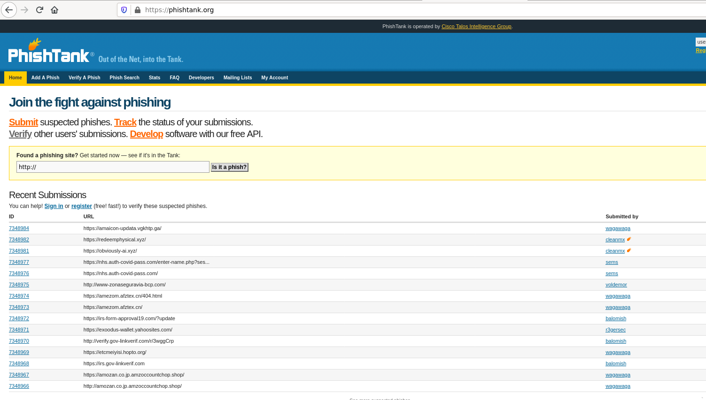
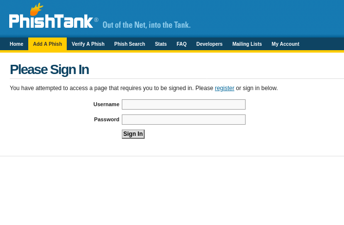
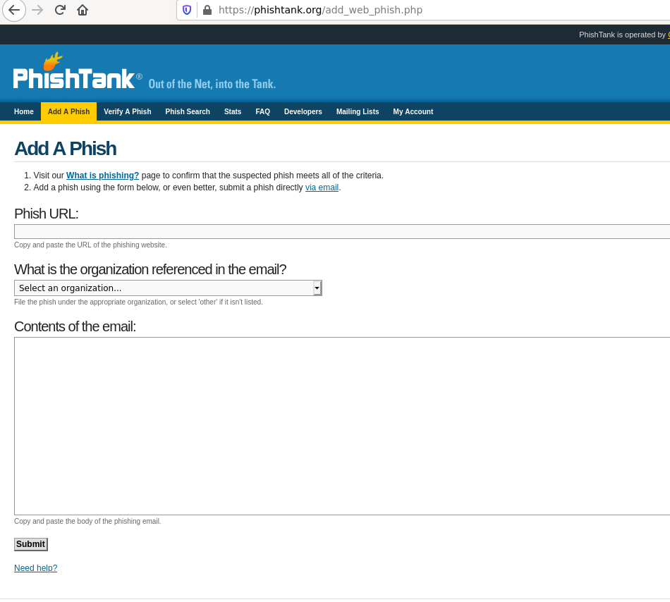
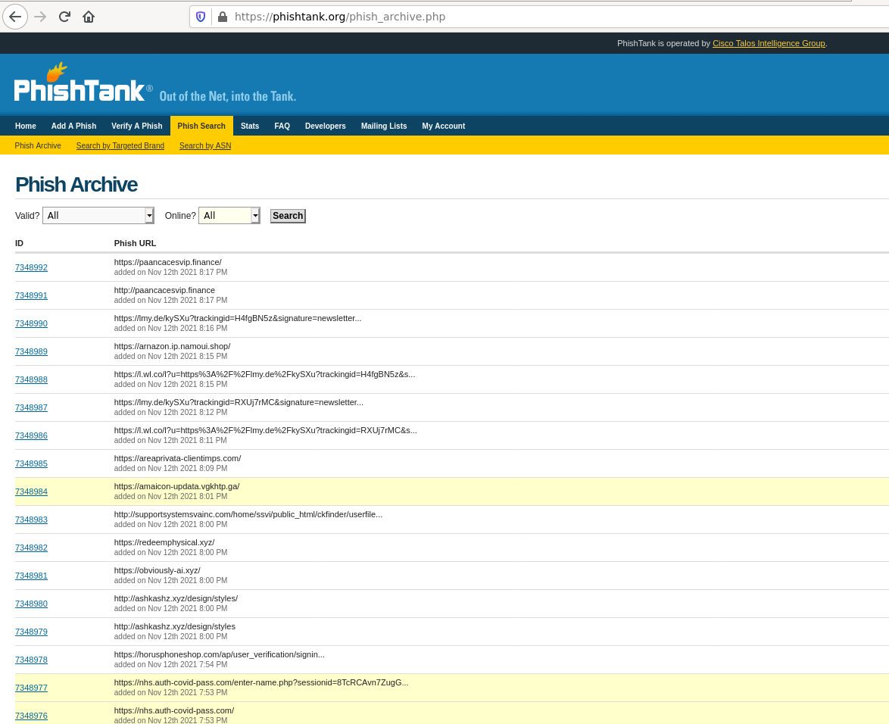
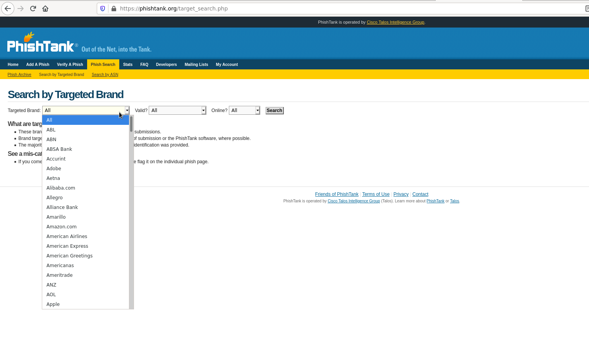
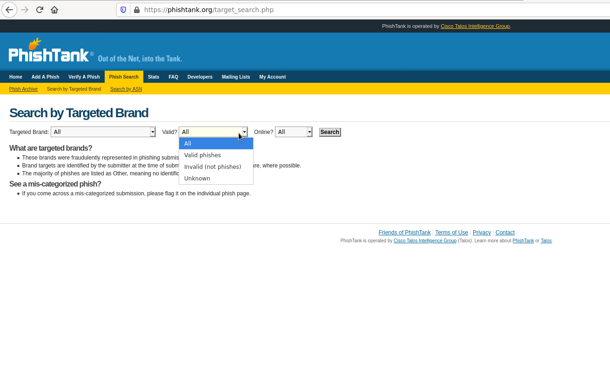
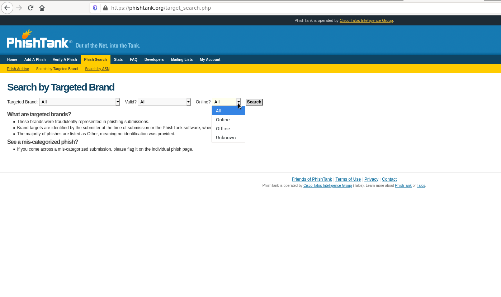
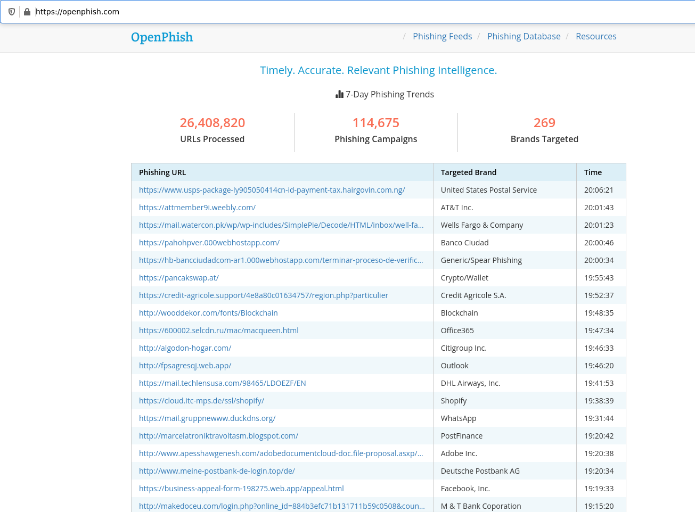

# Comunidades
Uma grande fatia das informações encontradas vem graças as comunidades, muitas delas possuem soluções e parcerias que muitas vezes analisam 24/7 em busca de novas informações. Vou comppartilhar algumas comunidades gratuitas e que podemos ter acesso de forma facil.

## MISP
### O que é o MISP
O MISP Threat Sharing é uma plataforma de inteligência de ameaças de código aberto. O projeto desenvolve utilitários e documentação para uma inteligência de ameaças mais eficaz, compartilhando indicadores de comprometimento. Existem várias organizações que executam instâncias MISP, listadas no site.

### Como ele pode nos ajudar ?
Temos a possibilidade de criar nossa propria infraestrutura, devida a rica documentação e por ser opensource conseguimos instalar em nosso servidor.
> https://github.com/MISP/MISP

#### MISP comunidades
O MISP possui diversas comunidades, algumas que apoiam diretamente o projeto e são:
> https://www.misp-project.org/communities/

- CIRCL (Centro de Incidente Response de Bruxelas)
> https://www.circl.lu/services/misp-malware-information-sharing-platform/

- CiviCERT (Computer Incident Response Center for Civil Society)
> https://civicert.org

- Entre outros

#### MISP feeds
Alem dos feeds defaults que vem por padrão.
> https://www.misp-project.org/feeds/

Temos diversos
- Phishing
> https://data.phishtank.com/data/online-valid.csv

- openphish
> https://openphish.com/feed.txt

## Phishingtank
O Phishingtank é uma comunidade incrivel onde podemos realizar a consulta ou adicionar paginas suspeitas.

### Como usar o Phishingtank ?
Para um melhor uso é necessario realização da criação de conta e entrar no sistema.

Podemos adicionar phishing indo até o **Add a Phish**.

Podemos tambem pesquisar por paginas suspeitas indo até **Phish Search**.

Alem disso é possivel buscar por uma empresa especifica.

E tambem filtrar por sites que foram validados como phishing.

E se ainda estão online.

Tambem podemos realizar o download da lista de dominios validos que é distribuidos no formato **.csv**.
> https://data.phishtank.com/data/online-valid.csv

## openphish
OpenPhish é uma plataforma independente totalmente automatizada para inteligência de phishing. Ele identifica sites de phishing e realiza análises de inteligência em tempo real, sem intervenção humana e sem usar recursos externos, como listas negras.
> https://openphish.com/feed.txt

## OUTRAS
> https://github.com/mitchellkrogza/Phishing.Database/blob/master/phishing-links-ACTIVE-today.txt
