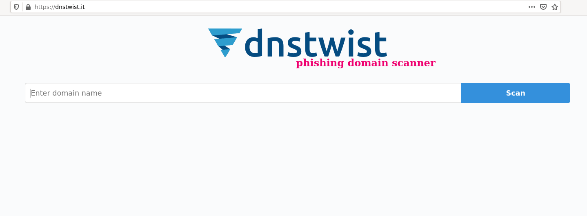
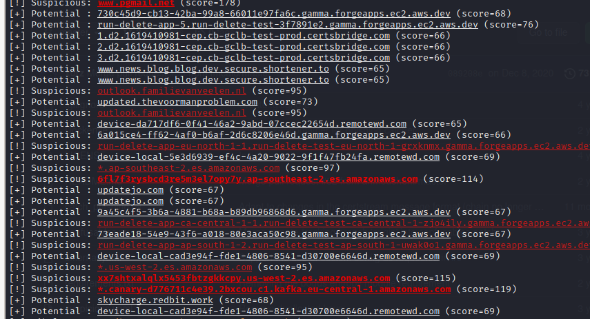
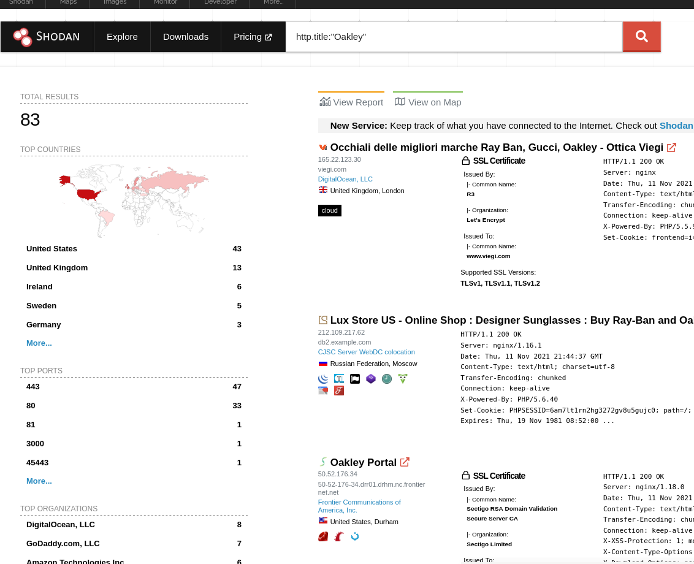

# Monitorando domínios

## TLD
### O que é TLD ?
TLD, ou Top Level Domain, é a parte final de um endereço de um site que vem logo após o nome.

Por exemplo:

- badbank(nome do site)

- .com.br(TLD)

Para melhor entendimento, o TLD seria a exata localização de uma empresa, seu endereço completo.

Por exemplo:

- badbank.com.br

Alguns exemplos de TLD são:

- .com

- .com.br

- .fun

- .info

- .com

- .us

- .co

- entre outros

Obviamente, ele não está em um domínio ao acaso, seu objetivo é realizar uma espécie de classificação do site. Ou seja, um site comercial cujo top-level domain é .com está informando que se trata de um site comercial.

Outro exemplo que temos é o WordPress.com, que é um site comercial, enquanto o WordPress.org se trata de uma versão sem fins lucrativos do grupo.
> Referencia: https://br.godaddy.com/blog/tld-o-que-e-quais-existem-e-como-escolher-o-ideal/
> [O que é TLD](https://pt.wikipedia.org/wiki/Dom%C3%ADnio_de_topo

Podemos ver algumas lista de TLDs no site oficial da IANA
> [Lista de TLDs da **IANA**](https://data.iana.org/TLD/tlds-alpha-by-domain.txt)

Ou uma lista completa disponiveis e as novidades que serão lançadas em TLDs.
> [TLDs de A a Z](https://tld-list.com/tlds-from-a-z)

### Criando uma lista de TLDs
Anteriormente vimos diversos sites que nos auxilia na listagem de possiveis TLDs, agora vamos usar o [tlds-from-a-z](https://tld-list.com/tlds-from-a-z) por ser o mais completo.

Vamos criar um arquivo .txt com os dominios e com o passar do tempo adicionando novos que forem encontrados durante o nosso trabalho ou até alguma atualização com TLDs novos.

Agora vamos alterar nossa lista e adicionar dominios que não estão na lista com foco no brasil, por exemplo **.gov.br**, podemos ver que não aparece esse dominio e seria interessante adicionar. Dominios .gov acabam não aparecendo e é interessante adicionar.
Por exemplo:

- sp.gov.br

- mg.gov.br

- pb.gov.br

- es.gov.br

- pa.gov.br

- rj.gov.br

- ba.gov.br

- ap.gov.br

- se.gov.br

- ce.gov.br

- go.gov.br

- df.gov.br

- rr.gov.br

- sc.gov.br
> Todas essas informações podem ser interessantes em algum momento da pesquisa, vai que um dominio governamental está sendo usado como phishing né ?!

## Soluções opensource
Temos soluções pagas que fazem esses serviços, mas o objetivo dessa oficina é usar apenas soluções opensource e que podemos analisar codigo fonte e até enviar melhorias.

### DNSTwist
O DNSTwist nos auxilia e reconhecimento de problema que os usuários podem ter ao tentar digitar seu nome de domínio.

Conseguimos analisar diversas tecnicas que os adversários possam usar para atacar você.

Algumas das tecnicas usadas são:

- Pode detectar erros de digitação;

- Ataques de phishing;

- Fraude;

- Falsificação de identidade de marca.

Com o **dnstwist** podemos encontrar fonte adicionais de inteligência sobre ameaças direcionadas a dominios especificos e graças a ela muitos dominios suspeitos são encontrados.
> [Site oficial - dnstwist](https://github.com/elceef/dnstwist/)

#### Instalando - DNSTwist
Podemos instalar o dnstwist de 3 formas, são elas:

- Via PIP;

- Via GIT;

- Via Docker.

##### Via PIP
Podemos realizar a instalação com o PIP da seguinte forma:
```sh
sudo pip install dnstwist
```
> Lembrando que precisa ter instalado o pip.

##### Via GIT
Caso queira ter a ultima versão do projeto podemos optar por usar a versão via GIT.
```sh
$ git clone https://github.com/elceef/dnstwist.git
$ cd dnstwist
$ pip install .
```

##### Via Docker
O Docker temos duas formas de realizar a instalação, são elas:

1. A primeira é usar a imagem oficial do dnstwist que está disponivel no Docker Hub,
```sh
$ docker run elceef/dnstwist
```

2. A segunda é criar uma imagem propria com o codigo que temos no github.
```sh
$ git clone https://github.com/elceef/dnstwist.git
$ cd dnstwist
$ docker build -t "greenmind/dnstwist:1" .
```

#### Versões online - DNSTwist
Alem de instalar o dnstwist, tambem podemos realizar o uso via web.
> [Projeto online oficinal do dnstwist](https://dnstwist.it/)

Com ele podemos realizar a consultas de dominio da mesma forma que fizemos via linha de comando, a diferença é que usamos a versão web.



### URLCrazy

#### O que é o URLCrazy?
O URLCrazy é uma solução opensource com foco em OSINT para gerar e testar erros de digitação ou variações de domínio para detectar ou executar erros de digitação, sequestro de URL, phishing e espionagem corporativa.
> https://github.com/urbanadventurer/urlcrazy

Conseguimos detectar invasores que lucram com erros de digitação em nomes de domínio, é possivel proteger uma marca registrando erros de digitação populares, alem de identificar domínio que receberão tráfego destinado a outro domínio e conduzir ataques de phishing durante um pentest.
#### Instalando o URLCrazy
Caso esteja usando o Kali Linux é possivel instalar usando apt.
```sh
$ sudo apt update
$ sudo apt install urlcrazy
```

#### Como podemos usar o URLCrazy
```sh
urlcrazy -p badbank.com.br
```
> Dessa forma ele vai nos retornar diversos domínios, seja registrados ou não.

### phishing_catcher
> https://github.com/x0rz/phishing_catcher

#### O que é o phishing_catcher ?
Com o phishing_catcher phishing é possivel detectar possíveis domínios de phishing quase em tempo real, isso é possivel devido ao projeto procurar por criação de certificados TLS suspeitas relatadas ao **Certificate Transparency Log (CTL)** por meio da **API CertStream**.

#### Instalando o phishing_catcher
Podemos instalar o **phishing_catcher** usando o codigo fonte dele que está disponivel no link a seguir:
```sh
$ git clone https://github.com/x0rz/phishing_catcher
$ cd phishing_catcher
$ sudo pip3 install -r requirements.txt
```

#### Como usar o phishing_catcher?
Podemos usar o phishing_catcher de forma simples, só chamar o arquivo com o python3.
```sh
$ python3 catch_phishing.py
```


### Buscando dominios indexados na internet
Vamos buscar por dominios que possam estar indexados na internet nos motores de busca, vou focar apenas no Google nessa oficina.

Precisar de 2 informações para uma melhor busca, são as:

- Dominio original;

- Titulo da pagina;

#### Realizando dorks para busca
Imaginando que o nosso site que estamos analisando seja o site da oakley que possui o dominio **oakley.com** e tem o titulo **Loja oficial Oakley®: Óculos de sol, Óculos de Proteção e Vestuário - Brazil**.
```sh
-site:oakley.com intitle:"Loja oficial Oakley®: Óculos de sol, Óculos de Proteção e Vestuário - Brazil"
```

### Buscando infraestruturas indexados na internet
> Lembrando que isso é apenas um introdução e vamos ver mais no capitulo de **buscando informações sobre infraestruturas**.

Assim como sites estão indexados na internet, informações de infraestruturas tambem estão e podem nos auxilixar na busca de sites maliciosos.

Vamos usar o Shodan, ele é uma solução incrivel que nos auxilia na busca de informações de infraestruturas.
> https://www.shodan.io/

É importante apenas uma informação, seja nome da empresa ou titulo que é o mais recomendado.

Para realizar a busca, vamos usar o operador **http.title**.
```sh
http.title:"Oakley"
```

